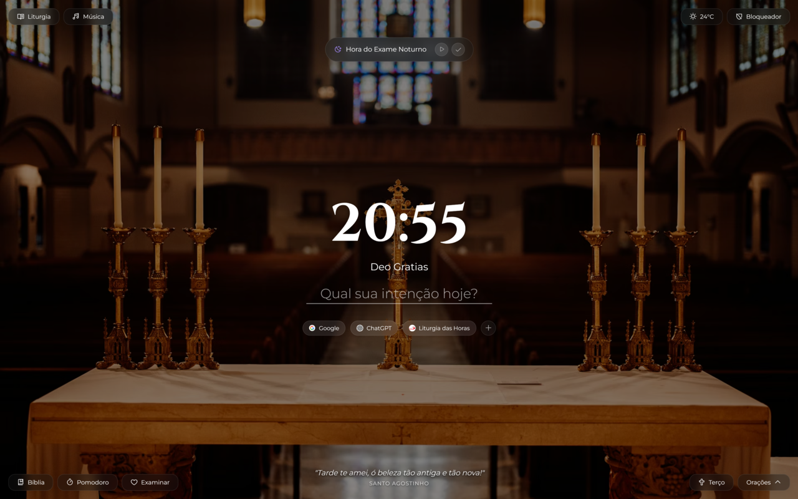

# Ora - Nova Aba Católica

**Ora** é uma extensão para navegadores (Google Chrome, Microsoft Edge, Brave, etc.) que transforma sua aba inicial em um ambiente de foco, oração e produtividade, com uma estética *glassmorphism* moderna e serena. O objetivo é ajudar o usuário a manter a presença de Deus ao longo do dia de trabalho ou estudo, integrando ferramentas de produtividade (como Método Pomodoro e Bloqueador de Sites) com práticas espirituais profundas (Angelus, Terço, Exame de Consciência).

Acesse **[oratime.com.br](https://oratime.com.br)** para fazer o download oficial da extensão.

## ✨ Funcionalidades Principais

### 🕊️ Espiritualidade e Oração
*   **Fundo e Frases Diárias:** Imagens inspiradoras e citações de santos que mudam diariamente.
*   **Lembretes de Oração (Sinos):**
    *   **Angelus:** Notificações automáticas nas horas canônicas (06h, 12h e 18h).
    *   **Terço da Misericórdia:** Lembrete às 15h.
*   **Santo Terço Interativo:**
    *   Visualização das contas do terço passo-a-passo.
    *   **Suporte a Latim e Português:** Alterne o idioma das orações facilmente.
    *   Seleção automática dos mistérios do dia (Gozosos, Dolorosos, Gloriosos, Luminosos).
    *   Modo **Terço da Misericórdia**.
*   **Orações e Liturgia:**
    *   **Biblioteca Pesquisável:** Encontre rapidamente orações específicas com a nova barra de busca.
    *   Leitor de orações com alternância rápida entre PT/LA.
    *   Link direto para a Liturgia Diária.
*   **Exame de Consciência:**
    *   Lembretes para Exame de Meio-Dia e Exame da Noite.
    *   Interface guiada para revisão do dia e preparação para o descanso.
*   **Virtudes:** Checklist diário para prática de virtudes.

### 🍅 Produtividade e Foco
*   **Focus Timer (Pomodoro):**
    *   Cronômetro de foco com intervalos curtos e longos personalizáveis.
    *   **Modo Imersivo (Tela Cheia):** Para foco total, minimizando distrações.
    *   **Mini Player:** Timer compacto que permanece visível.
    *   Estatísticas de tempo focado no dia.
*   **Bloqueador de Sites:**
    *   Bloqueie sites distrativos (ex: redes sociais) durante o trabalho.
    *   Gerenciamento fácil da lista de bloqueios via menu de configurações.
    *   Utiliza a API nativa `declarativeNetRequest` para bloqueio eficiente e seguro.
*   **Links Rápidos:**
    *   Acesso rápido aos seus sites favoritos (até 6 links) com ícones automáticos.
    *   Modal dedicado para adicionar, remover e organizar seus atalhos.

### 🎵 Música e Ambiente
*   **Player de Música Integrado:**
    *   Suporte a playlists do **Spotify** e vídeos/playlists do **YouTube**.
    *   Adicione suas próprias músicas colando o link.
    *   Mini-player que continua tocando executando em segundo plano (via relay).

### 🎨 Design e Experiência
*   **Estética Glassmorphism:** Design moderno com transparências e desfoque.
*   **Animações Suaves:** Transições fluidas ao abrir e fechar modais e menus.
*   **Totalmente Responsivo:** Adapta-se a diferentes tamanhos de janela.

### ⚠️ Dificuldades e Soluções Técnicas
*   **Erro 153 do YouTube (Restrição de Origem):**
    *   Vídeos do YouTube frequentemente retornavam o *Erro 153* ou *152* dentro da extensão. Isso ocorre porque o YouTube bloqueia a reprodução de certos conteúdos quando a origem é uma extensão local (`chrome-extension://`).
    *   **Solução (Relay):** Foi implementado um "Relay" hospedado no GitHub Pages. O player da extensão carrega um `iframe` que aponta para essa página externa, passando os parâmetros do vídeo via URL. Assim, o servidor do YouTube reconhece uma origem web válida e permite a reprodução.

## 📥 Download e Instalação

A maneira oficial e mais atualizada de obter a extensão **Ora** é baixando através do nosso site:

👉 **Acesse: [oratime.com.br](https://oratime.com.br)**

Lá você encontrará guias ilustrados passo a passo para instalação no Google Chrome e no Microsoft Edge.

### 🛠️ Instalação Manual (Código Fonte / Modo Desenvolvedor)

Caso você queira utilizar a versão de desenvolvimento mais recente deste repositório, siga os passos abaixo:

1.  Baixe o `.zip` ou clone este repositório (`git clone`) em seu computador.
2.  Abra o seu navegador (Chrome, Edge, Brave) e acesse a página de extensões: `chrome://extensions` ou `edge://extensions`.
3.  Ative o **Modo do desenvolvedor** (geralmente no canto superior direito ou esquerdo).
4.  Clique no botão **Carregar sem compactação** (Load unpacked).
5.  Selecione a pasta raiz do projeto (`.../Ora`) onde se encontra o arquivo `manifest.json`.
6.  Pronto! Abra uma nova aba no seu navegador e o Ora estará ativo.

## ⚙️ Configuração

*   **Permissões:** A extensão solicitará permissão para substituir a "Nova Aba", gerenciar "Armazenamento" (para salvar suas preferências) e "Bloqueio de Conteúdo" (`declarativeNetRequest` para o bloqueador de sites).
*   **Personalização:**
    *   Clique no ícone de engrenagem no Timer de Foco para ajustar os tempos de Pomodoro.
    *   No player de música, cole links do YouTube ou Spotify para criar sua biblioteca pessoal.
    *   Adicione sites ao bloqueador através do menu no canto inferior esquerdo.

## 💻 Tecnologias Utilizadas

*   **HTML5, CSS3, JavaScript (Vanilla ES6+):** Arquitetura modular para melhor organização e manutenção.
*   **Chrome Extension Manifest V3:** Padrão mais recente e seguro para extensões.
*   **Web Storage API:** Para salvar dados localmente (playlists, histórico de foco, preferências).
*   **Phosphor Icons:** Biblioteca de ícones moderna e limpa.

## 📁 Estrutura do Projeto

*   `manifest.json`: Configurações da extensão.
*   `ora.html`: Interface principal (Nova Aba).
*   `script.js`: (Obsoleto) Lógica antiga, migrada para `scripts/main.js`.
*   `assets/`: Imagens e ícones.
*   `data/`: Arquivos JSON com base de dados (orações, citações, etc).
*   `scripts/`:
    *   `main.js`: Ponto de entrada, inicialização dos módulos.
    *   `utils.js`: Funções utilitárias compartilhadas.
    *   `modules/`:
        *   `auth.js` / `user.js`: (Futuro) Gerenciamento de usuário.
        *   `background.js`: Gerenciamento do papel de parede diário.
        *   `blocker.js`: Lógica de bloqueio de sites.
        *   `exam.js`: Exame de consciência e lembretes noturnos.
        *   `focus.js`: Lógica do Pomodoro Timer.
        *   `links.js`: Gerenciamento dos Links Rápidos.
        *   `music.js`: Player de música e integração com YouTube/Spotify.
        *   `prayers.js`: Sistema de orações, busca e liturgia.
        *   `reminders.js`: Agendamento de notificações (Angelus, Terço).
        *   `rosary.js`: Motor do Santo Terço.

---
*Desenvolvido com o propósito de santificar o tempo de trabalho.* 🙏